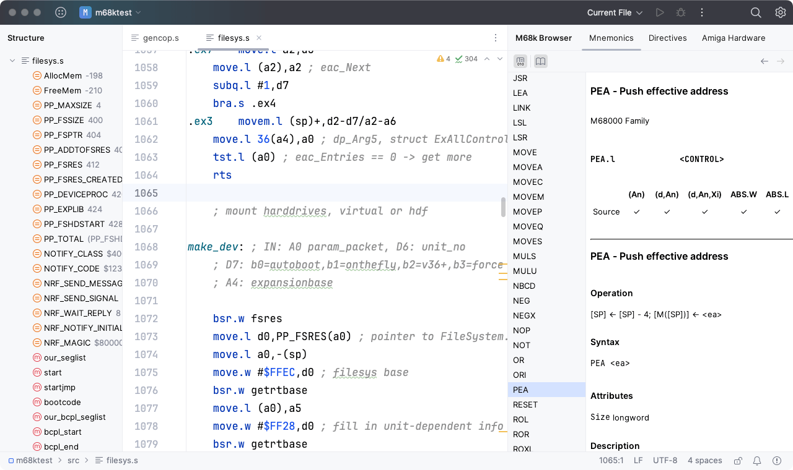

## Motorola 68000 Series Assembly Language Support for IntelliJ based IDEs

Adds support for [Motorola 68000 series](https://en.wikipedia.org/wiki/Motorola_68000_series) assembly language
in [IntelliJ](https://plugins.jetbrains.com/docs/intellij/intellij-platform.html#ides-based-on-the-intellij-platform) based IDEs.

**📖 Please visit the [Documentation site](https://yanncebron.github.io/m68kplugin/) for user guide. 📖** 

Please see [Contributing](CONTRIBUTING.md) on how to submit feedback and contribute to this project.

## Installation
            
- Open [Plugin Homepage](https://plugins.jetbrains.com/plugin/17712-motorola-68000-series-assembler/) and click *Install to...* button on upper right

- Using IDE built-in plugin system:

  <kbd>Settings</kbd> > <kbd>Plugins</kbd> > <kbd>Marketplace</kbd> > <kbd>Search for "Motorola 68000 Series Assembler"</kbd> >  <kbd>Install Plugin</kbd>

- Manually:

  Download the [latest release](https://github.com/YannCebron/m68kplugin/releases/latest) and install it manually
  using
  <kbd>Settings</kbd> > <kbd>Plugins</kbd> > <kbd>⚙️</kbd> > <kbd>Install plugin from disk...</kbd>

## Credits

Plugin Logo from [Wikimedia Commons](https://commons.wikimedia.org/wiki/File:Motorola_M_symbol_blue.svg)

Mnemonic and directives documentation taken from [m68k-instructions-documentation](https://github.com/prb28/m68k-instructions-documentation)

Mnemonic data generated using [vasm](http://sun.hasenbraten.de/vasm/) sources, thanks to Frank Wille and Dr. Volker Barthelmann for granting permission

Amiga hardware register documentation generated from [AGA.guide](https://github.com/rkrajnc/minimig-mist/blob/master/doc/amiga/aga/AGA.guide)

## License

Licensed under the Apache License, Version 2.0 (the "License"), see [LICENCE](LICENCE)

This software includes [commonmark-java](https://github.com/atlassian/commonmark-java) library, Copyright (c) 2015-2016, Atlassian Pty Ltd

*All product names, trademarks, and registered trademarks are property of their respective owners.*
