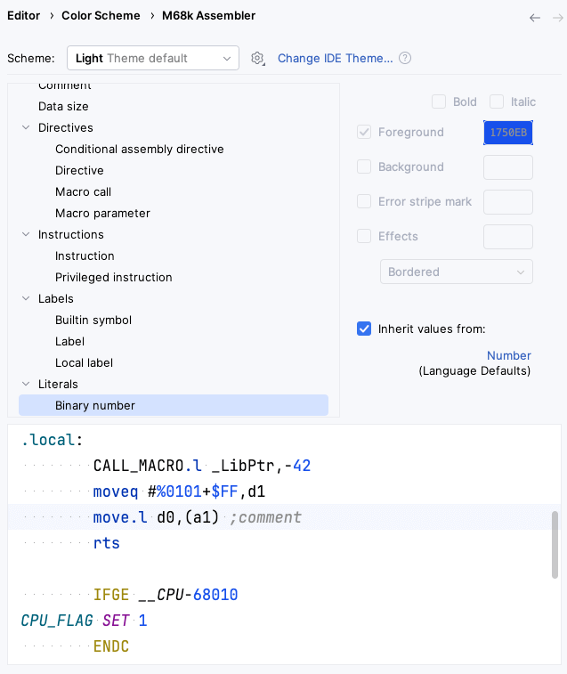
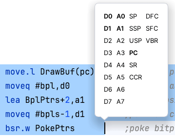

# Editor

## Syntax Highlighting
 
### Settings

Fully customizable via *Settings/Preferences \| Editor \| Color Scheme \| M68k Assembler*.

Virtually every syntax element can be configured separately.
Additional semantic highlighting is performed for privileged instructions (possibly depending on operands).

### Parser Highlighting

Detailed on-the-fly semantic error highlighting for all instructions and directives

### Method Separator

For `macro`/`endm` and `section` via *Show method separators* option in *Settings/Preferences \| Editor \| General \| Appearance*
 
### Highlight matching brace and directives

                            
### Highlight Misc
 
* Highlight/navigate URLs in comments and string literals

## Documentation

_Hover_: enable _Show quick documentation on hover_ in *Settings/Preferences \| Editor \| Code Editing*

### Mnemonics

_View \| View Quick Documentation_ Show mnemonic documentation (or on mouse hover), current variant is underlined

_M68k Browser_ tool window lists all supported mnemonics with additional reference documentation

### Labels

*View \| Quick Documentation* for labels: show preceding lines or EOL comment(s)
                      

<kbd>Ctrl+Click</kbd>: Show type and value tooltip for labels

### Literals

*View \| Quick Documentation* for number literal: show in decimal, hexadecimal, octal, and binary notation

## Labels

*Navigate \| Declaration or Usages* - <kbd>Ctrl+Click</kbd>
                
### Completion

Smart completion for labels, e.g., ranking current local labels and labels from the current file higher in suggestions
 
### Builtin Symbols 

Completion and <kbd>Ctrl+Click</kbd> hover information

### Quick Definition 

*View \| Quick Definition* to inspect label at caret in popup without leaving current editor

### Find Usages 

*Edit \| Find Usages* (grouped by type)

### Rename Refactoring

Rename labels using *Refactor \| Rename* across whole project with usages preview

                     
## Editing

* Smart *Edit \| Extend/Shrink Selection*
* Smart braces/quote handling
* *Code \| Comment with Line Comment*
* *Code \| Move Element Left/Right* for `exg`/`cmpm`, binary expressions, register list, macro call parameters, `dc`/`dr` values
* *Move Caret to Code Block Start/End* for matching directives
* Spellchecker with bundled dictionaries (M68k/Amiga)
* Code Folding (*Settings/Preferences \| Editor \| General \| Code Folding*)
  * Zero-terminated string literal (`dc.b "a text",0`)
  * Custom regions via enclosing `* region [placeholderText]` / `* endregion` comments
* Live Templates (*Settings/Preferences \| Editor \| Live Templates*)
* Code Style Settings (*Settings/Preferences \| Editor \| Code Style \| M68k Assembler*)
  * Tab Size
  * Visual Guides

## Code Insight

### Intentions

Invoke intention via <kbd>Alt</kbd>+<kbd>Enter</kbd>

*Show Used/Free Registers* for selection

