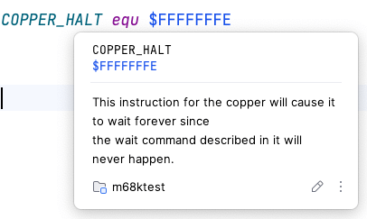
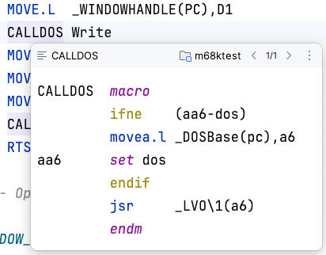

# Editor

## Syntax Highlighting
 
### Settings

Fully customizable via *Settings/Preferences \| Editor \| Color Scheme \| M68k Assembler*

### Parser Highlighting

Detailed on-the-fly semantic error highlighting

* Method separator for `macro`/`endm`, `section` blocks
* Highlight privileged instructions
* Highlight matching brace/paired directives
* Highlight/navigate URLs in comments and string literals

## Documentation

_Hover_: enable _Show quick documentation on hover_ in *Settings/Preferences \| Editor \| Code Editing*

### Mnemonics

*View \| Quick Documentation* reference documentation for mnemonics

_Hover_: Show mnemonic reference overview on mouse hover; link to reference documentation

### Labels

*View \| Quick Documentation* for labels: show preceding lines or EOL comment(s)
                      

_Hover_: Show type and value tooltip for labels on mouse hover

### Literals

*View \| Quick Documentation* for number literal: show in decimal, hexadecimal, octal, and binary notation

## Labels

*Navigate \| Declaration or Usages* - <kbd>Ctrl+Click</kbd>

### Quick Definition 

*View \| Quick Definition* to inspect label at caret in popup

### Find Usages 

*Edit \| Find Usages* (grouped by type)

### Rename Refactoring

Rename labels using *Refactor \| Rename* across whole project with usages preview

                     
## Editing

* Smart *Edit \| Extend/Shrink Selection*
* *Code \| Comment with Line Comment*
* *Code \| Move Element Left/Right* for `exg`, binary expressions, register list, `dc` values
* *Move Caret to Code Block Start/End* for matching directives
* Spellchecker with bundled dictionaries (M68k/Amiga)
* Code Folding (*Settings/Preferences \| Editor \| General \| Code Folding*)
  * Zero-terminated string literal (`dc.b "a text",0`)
  * Custom regions via enclosing `* region [placeholderText]` / `* endregion` comments
* Live Templates (*Settings/Preferences \| Editor \| Live Templates*)
* Code Style Settings (*Settings/Preferences \| Editor \| Code Style \| M68k Assembler*)
  * Tab Size
  * Visual Guides

## Code Insight

### Intentions

Invoke intention via <kbd>Alt</kbd>+<kbd>Enter</kbd>

*Show Used/Free Registers* for selection

