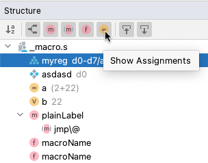
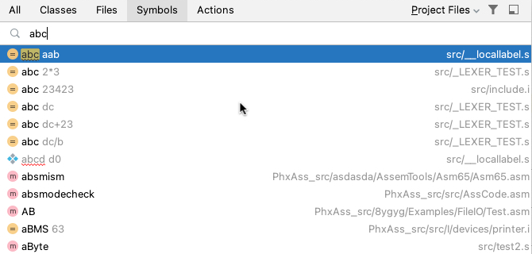
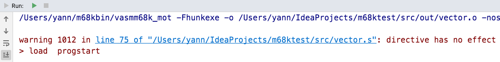

# IDE

## Navigation

### Structure

*Structure View* tool window and *Navigate \| File Structure* popup for current file

### Navigation

*Navigate \| Symbol* for labels

## External Tools

Navigate to _file:lineNumber_ location or label(s) from vasm console message
                     

## Version Control

Completion of label names in _Commit Message_

## Other

Register `FILE_ID.DIZ`, `startup-sequence`, and `*.NFO` files as plain text

