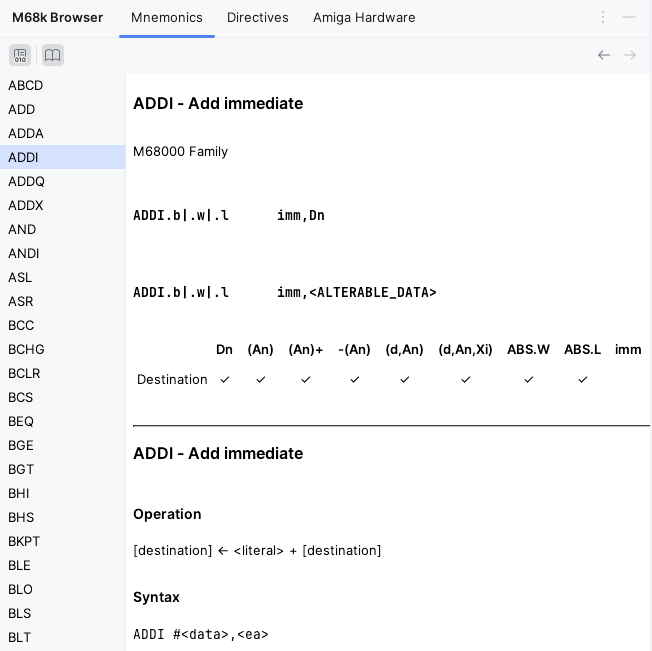
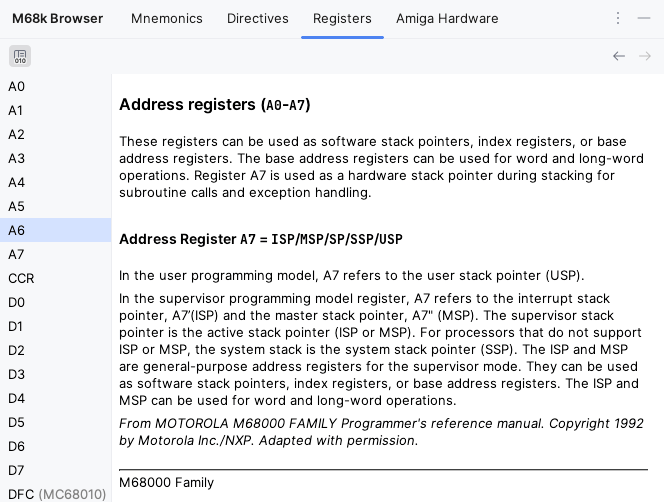
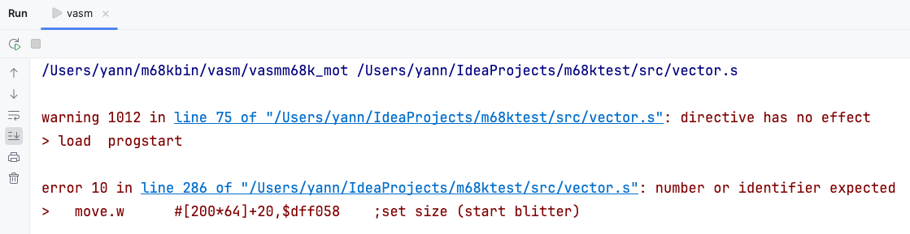

# IDE

## Navigation

*Navigate \| Symbol* for labels

## M68k Browser Tool Window

Provides access to all reference documentation.

> 💡To search for entries, start typing while the focus is on the element list on the left.

### Mnemonics

Browse all supported mnemonics with additional reference documentation

### Directives

Browse all supported (conditional assembly) directives with reference documentation

### Registers

Browse all supported registers with reference documentation

### Amiga Hardware

Browse all hardware registers with additional reference documentation.

Register list can be filtered by _OCS_, _ECS_, and _AGA_ chip set and `CIAx` registers can be toggled.

Use the _i_ toggle button to show Chip Set information in the list.

## External Tools

Navigate to _file:lineNumber_ location or label(s) from vasm console messages
                     

## Version Control

Completion of label names in _Commit Message_

## Other

Register `FILE_ID.DIZ`, `startup-sequence`, and `*.NFO` files as plain text files

