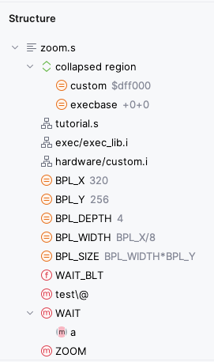
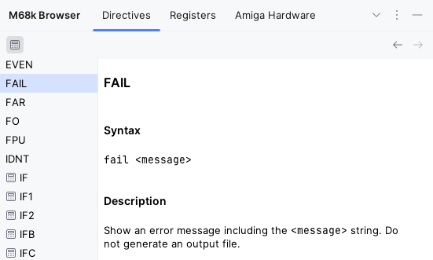

# IDE

## Navigation

### Structure

*Structure View* tool window and *Navigate \| File Structure* popup for current file

### Navigation

*Navigate \| Symbol* for labels

## M68k Browser Tool Window

Provides access to all reference documentation.

> 💡To search for entries, simply start typing while focus is on element list on the left.

### Mnemonics

Browse all supported mnemonics with additional reference documentation

### Directives

Browse all supported directives with reference documentation

### Amiga Hardware

Browse all hardware registers with additional reference documentation.

Register list can be filtered by OCS, ECS, and AGA chip set.
Use _i_ toggle button to show Chip Set information in list.

## External Tools

Navigate to _file:lineNumber_ location or label(s) from vasm console message
                     

## Version Control

Completion of label names in _Commit Message_

## Other

Register `FILE_ID.DIZ`, `startup-sequence`, and `*.NFO` files as plain text

