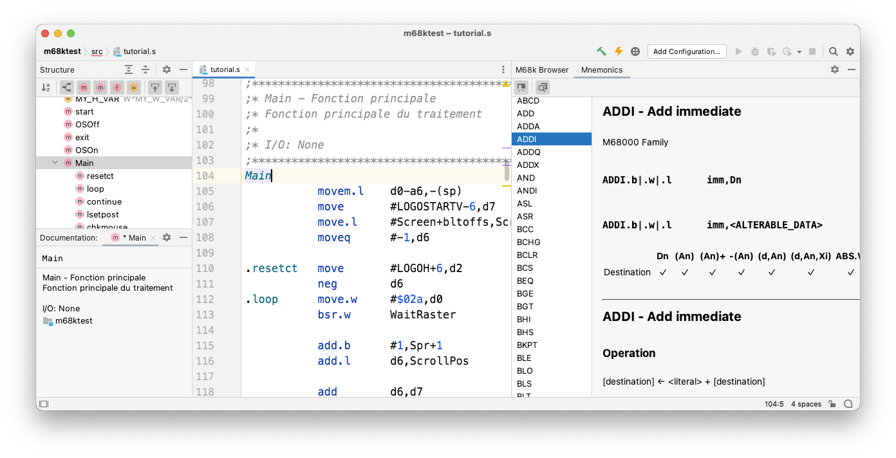

## Motorola 68000 Series Assembly Language Support for IntelliJ-based IDEs
                                  
Adds support for [Motorola 68000 series](https://en.wikipedia.org/wiki/Motorola_68000_series) assembly language
in [IntelliJ](https://plugins.jetbrains.com/docs/intellij/intellij-platform.html#ides-based-on-the-intellij-platform) based IDEs
(including [IntelliJ IDEA](https://www.jetbrains.com/idea/), [Android Studio](https://developer.android.com/studio/), and many more).

> **NOTE:** This plugin is at a very early stage and provided "as-is", please see also [Known Issues](known_issues.md).

## Installation

There are currently no published releases, snapshot artifacts for [manual installation](https://www.jetbrains.com/help/idea/plugins-settings.html) are available via [GitHub CI](https://github.com/YannCebron/m68kplugin/actions?query=workflow%3A%22Build+%26+Test%22).

Plugin is compatible with IDE version 2020.2.4 and later.              

> **TIP:** Not familiar with IntelliJ-based IDEs? See [Getting Started Guide](https://www.jetbrains.com/help/idea/getting-started.html).
               
## About this guide
     
This guide uses the following notations to distinguish certain items:

- *Main Menu \| Sub Menu \| Menu Item* - menu item/action
- *Settings/Preferences \| Settings Page* - page in _Settings/Preferences_ dialog
- `monospaced text` - assembly code
- <kbd>F10</kbd> - keyboard shortcut or input

---

Please visit the [Project Homepage on GitHub](https://github.com/YannCebron/m68kplugin) for Credits, License and Code of Conduct.
