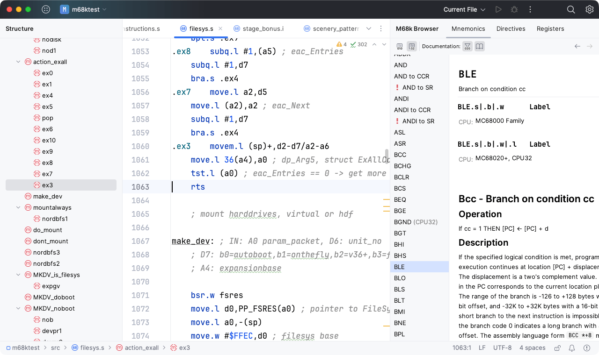

## Motorola 68000 Series Assembly Language Support for IntelliJ-based IDEs

Support for [Motorola 68000 series](https://en.wikipedia.org/wiki/Motorola_68000_series) assembly language
in [IntelliJ](https://plugins.jetbrains.com/docs/intellij/intellij-platform.html#ides-based-on-the-intellij-platform)-based IDEs (IntelliJ IDEA, CLion, ...)
providing smart code insight, inspections, built-in documentation and many more features.

> This plugin is at an early stage and provided "as-is", please see also [Known Issues](known_issues.md).

Please [leave a comment and rating](https://plugins.jetbrains.com/plugin/17712-motorola-68000-series-assembler/reviews) if you like this plugin 😀

Visit the [Project Homepage on GitHub](https://github.com/YannCebron/m68kplugin) for Credits, License and Code of Conduct.
             

