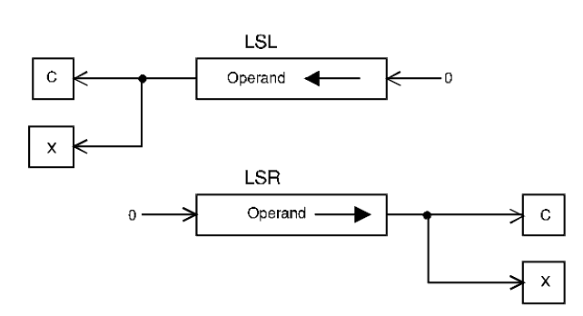

# LSL, LSR - Logical shift left/right

## Operation
[destination] ← [destination] shifted by \<count\>

## Syntax
```assembly
LSL Dx,Dy
LSR Dx,Dy
LSL #<data>,Dy
LSR #<data>,Dy
LSL <ea>
LSR <ea>
```

## Attributes
`Size` byte, word, longword

## Description
Logically shift the bits of the operand in the specified direction (i.e., left or right). A zero is shifted into the input position and the bit shifted out is copied into both the C- and the X-bit of the CCR. The shift count may be specified in one of three ways. The count may be a literal, the contents of a data register, or the value 1. An immediate count permits a shift of 1 to 8 places. If the count is in a register, the value is modulo 64 - from 0 to 63. If no count is specified, one shift is made (e.g., `LSL <ea>` shifts the *word* at the effective address one position left).



## Application
If [D3.W] = 1100110010101110<sub>2</sub> , the instruction `LSL.W #5,D3` produces the result 1001010111000000<sub>2</sub>. After the shift, both the X-and C-bits of the *CCR* are set to 1 (since the last bit shifted out was a 1).

## Condition codes
| X | N | Z | V | C |
|:-:|:-:|:-:|:-:|:-:|
|*|*|*|0|*|

The X-bit is set to the last bit shifted out of the operand and is equal to the C-bit. However, a zero shift count leaves the X-bit unaffected and the C-bit cleared.

## Destination operand addressing modes
|Dn|An|(An)|(An)+|&#x2011;(An)|(d,An)|(d,An,Xi)|ABS.W|ABS.L|(d,PC)|(d,PC,Xn)|imm|
|:-:|:-:|:-:|:-:|:-:|:-:|:-:|:-:|:-:|:-:|:-:|:-:|
|✓||✓|✓|✓|✓|✓|✓|✓||||

*From MOTOROLA M68000 FAMILY Programmer's reference manual. Copyright 1992 by Motorola Inc./NXP. Adapted with permission.*