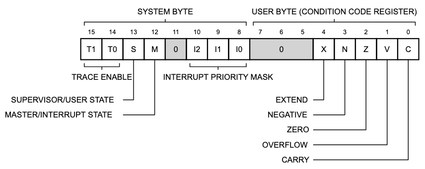

# Status Register (`SR`)

The SR stores the processor status and contains the condition
codes that reflect the results of a previous operation.

In the supervisor mode, software can access the full SR, including the interrupt priority mask and additional control
bits. These bits indicate the following states for the processor: one of two trace modes (T1, T0), supervisor
or user mode (S), and master or interrupt mode (M).

For the MC68000, MC68EC000, MC68008, MC68010, MC68HC000, MC68HC001, and CPU32, only one trace mode is
supported, where T0 is always zero, and only one system stack where the M-bit is always
zero. I2, I1, and I0 define the interrupt mask level.

## Status Register Bits

### _15–8 SYSTEM BYTE_

#### TRACE MODE: `T1`/`T0`

|   T1    |   T0    | Trace Mode               |
|:-------:|:-------:|--------------------------|
| &nbsp;&nbsp;0 | &nbsp;&nbsp;0 | &nbsp;&nbsp;NO TRACE                 |
| &nbsp;&nbsp;1 | &nbsp;&nbsp;0 | &nbsp;&nbsp;TRACE ON ANY INSTRUCTION |
| &nbsp;&nbsp;0 | &nbsp;&nbsp;1 | &nbsp;&nbsp;TRACE ON CHANGE OF FLOW  |
| &nbsp;&nbsp;1 | &nbsp;&nbsp;1 | &nbsp;&nbsp;UNDEFINED                |

#### MASTER/INTERRUPT STATE: `S`/`M`

|    S    |    M    | Active Stack |
|:-------:|:-------:|--------------|
| &nbsp;&nbsp;0 | &nbsp;&nbsp;x | &nbsp;&nbsp;USP          |
| &nbsp;&nbsp;1 | &nbsp;&nbsp;0 | &nbsp;&nbsp;ISP          |
| &nbsp;&nbsp;1 | &nbsp;&nbsp;1 | &nbsp;&nbsp;MSP          |

#### INTERRUPT PRIORITY MASK: `I2`/`I1`/`I0`

### _7–0 USER BYTE ([CCR](ccr.md))_